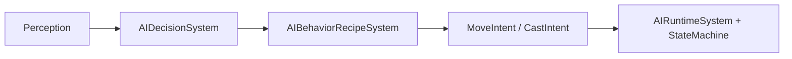

# AI Subsystem

> **Scheduling:** AI spans multiple phases—perception/producers write data in `RequestsSystemGroup`, `AIDecisionSystem` and `AIBehaviorRecipeSystem` also sit in `RequestsSystemGroup`, while `AIRuntimeSystem` executes intents in `RuntimeSystemGroup`. Custom systems should hook into the same groups instead of referencing concrete system types.  
> **Timebase:** Decision timers rely on `SystemAPI.Time.ElapsedTime` (interval seconds). Movement/casting follow whichever subsystem they touch (spells, nav).



### Units & invariants

- Decision intervals are seconds.  
- Distances use squared meters unless otherwise stated (e.g., `LastSeenDistanceSq`).  
- Health thresholds are normalized 0–1 floats.

### Buffer ownership & lifetime

- `StateChangeRequest`, `MoveIntent`, and `CastIntent` buffers live on AI agents. Systems that add to them must clear them after processing (as shown in examples).  
- Behavior recipes are blob assets referenced by `AIBehaviorRecipeRef`; dispose them when no longer needed.

### Telemetry & performance notes

- Emit telemetry (e.g., “StateChanged”) inside systems that clear the buffers so analytics see the final decision results.  
- Keep decision intervals ≥0.1s to avoid hammering Burst loops.  
- Recipes are Burst-friendly; avoid capturing managed delegates when constructing them.

### Responsibilities

- Spawn agents with default state/config/runtime data.
- Evaluate perception + decision rules to choose behaviors.
- Run behavior recipes that emit `MoveIntent` and `CastIntent` entries.

### Key types

| Type | Purpose |
| --- | --- |
| `AIFactory` | Creates an agent with `AIState`, intents, config, and buffers. |
| `AIState`, `AIAgentBehaviorConfig`, `AIAgentDecisionState` | Core components describing state machine + decision cadence. |
| `AIDecisionSystem` | Reads perception buffers/lookups and schedules `StateChangeRequest`s. |
| `AIBehaviorRecipe` / `AIBehaviorRecipeSystem` | Rule-based/utility selection that writes intents. |
| `AIStateMachineSystem`, `AIRuntimeSystem` | Execute intents: move, cast, clear, enforce leashes. |
| `AIBehaviorBuilder` | Fluent API to build blob recipes in authoring scripts/tests. |

### Example: Spawning an AI agent

```csharp
using Framework.AI.Factory;

void SpawnEnemy(ref EntityManager em)
{
    AIFactory.SpawnAgent(ref em, out var agent);

    // Optional config overrides
    var cfg = em.GetComponentData<Framework.AI.Components.AIAgentBehaviorConfig>(agent);
    cfg.DecisionIntervalSeconds = 0.25f;
    cfg.PrimarySpellId = (FixedString64Bytes)"spell.fireball";
    em.SetComponentData(agent, cfg);
}
```

### Example: Building and assigning a recipe

```csharp
using Framework.AI.Behaviors.Authoring;
using Framework.AI.Behaviors.Components;

void InstallRecipe(ref EntityManager em, Entity agent)
{
    var cfg = em.GetComponentData<Framework.AI.Components.AIAgentBehaviorConfig>(agent);
    AIBehaviorBuilder.New("Archer")
        .Rule("Chase if target out of range",
            cond => cond.HasTarget().Visible().NotInRange(c => c.AttackRange),
            act => act.MoveChase(c => c.MoveSpeed))
        .Rule("Cast when in range",
            cond => cond.HasTarget().InRange(c => c.AttackRange),
            act => act.CastPrimary())
        .Default(act => act.MoveFlee(c => c.FleeMoveSpeed, c => c.FleeRetreatDistance))
        .BuildBlob(in cfg, out var recipeBlob);

    em.AddComponentData(agent, new AIBehaviorRecipeRef { Recipe = recipeBlob });
}
```

### Example: Responding to state change requests

```csharp
[UpdateInGroup(typeof(Framework.Core.Base.RequestsSystemGroup))]
public partial struct CustomAIStateSystem : ISystem
{
    public void OnUpdate(ref SystemState state)
    {
        foreach (var requests in SystemAPI.Query<DynamicBuffer<StateChangeRequest>>())
        {
            for (int i = 0; i < requests.Length; i++)
            {
                var request = requests[i];
                // Custom logging, analytics, etc.
            }
            requests.Clear();
        }
    }
}
```

Keep custom systems in the `RequestsSystemGroup` so they run before recipes consume the data.

## Detailed example: full AI loop (perception → decision → execution)

1. **Perception** populates `PerceptionTargetCandidate` buffers (not shown here).  
2. **Decision** uses `AIDecisionSystem` to pick a state every 0.5s.  
3. **Recipes** choose between chasing, fleeing, or casting depending on health + range.  
4. **Runtime** systems (`AIRuntimeSystem`, `AIStateMachineSystem`) turn intents into movement and spell casts.

```csharp
public static void SetupArcherAI(ref EntityManager em, Entity agent, BlobAssetReference<AIBehaviorRecipe> recipe)
{
    var config = em.GetComponentData<AIAgentBehaviorConfig>(agent);
    config.DecisionIntervalSeconds = 0.5f;
    config.AttackRange = 20f;
    config.FleeHealthThresholdPercent = 0.25f;
    config.PrimarySpellId = (FixedString64Bytes)"spell.arrow-shot";
    em.SetComponentData(agent, config);
    em.AddComponentData(agent, new AIBehaviorRecipeRef { Recipe = recipe });
}

// Recipe builder (authoring time)
AIBehaviorBuilder.New("Archer")
    .Rule("Flee when low health",
        cond => cond.HasTarget().HealthBelow(c => c.FleeHealthThresholdPercent),
        act => act.MoveFlee(c => c.FleeMoveSpeed, c => c.FleeRetreatDistance))
    .Rule("Chase if target out of range",
        cond => cond.HasTarget().Visible().NotInRange(c => c.AttackRange),
        act => act.MoveChase(c => c.MoveSpeed))
    .Rule("Cast when in range",
        cond => cond.HasTarget().InRange(c => c.AttackRange),
        act => act.CastPrimary())
    .Default(act => act.Stop())
    .BuildBlob(in config, out var recipeBlob);

SetupArcherAI(ref em, agent, recipeBlob);
```

At runtime:

- `AIDecisionSystem` calculates `healthPercent`, inspects target visibility, and writes a `StateChangeRequest` if the desired state differs.  
- `AIBehaviorRecipeSystem` reads the `AIBehaviorRecipeRef`, evaluates conditions in priority order, and writes `MoveIntent` / `CastIntent`.  
- `AIRuntimeSystem` enforces leashes, while `CastPipelineRunnerSystem` consumes the cast intent and enqueues spells.

### See also

- [`Spells.md`](Spells.md) – casting pipeline driven by AI intents.  
- [`AreaEffects.md`](AreaEffects.md) – how AI can react to hazards.  
- [`Resources.md`](Resources.md) / [`Stats.md`](Stats.md) – data AI often inspects during decisions.  
- [`Lifecycle.md`](Lifecycle.md) – four-phase overview for scheduling custom AI helpers.
