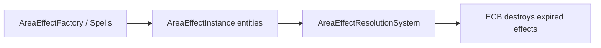

# Area Effects Subsystem

> **Scheduling:** `AreaEffectResolutionSystem` runs in `Framework.Core.Base.ResolutionSystemGroup`. Spawn effects via `AreaEffectFactory` (or `AreaEffectDriver`) and let the resolution system handle cleanup.  
> **Timebase & units:** Lifetimes are in **seconds** (scaled by `TemporalModifiers`). Positions/radii are `float2` values in world units (meters by convention); angles are in **degrees** if you expand beyond circles.



### Responsibilities

- Spawn temporary entities that represent area effects (ground damage, buff zones, etc.).  
- Track lifetime and destroy the entity when time elapses (with temporal modifier support).  
- Provide spatial helpers to test positions against circles or AABBs.

### Key types

| Type | Purpose |
| --- | --- |
| `AreaEffectFactory.AreaEffectInstance` | Component storing ID, lifetime, `float2 Center`, `float Radius`. |
| `AreaEffectFactory` / `AreaEffectDriver` | Helper APIs for spawning shapes. |
| `AreaEffectResolutionSystem` | Decrements lifetime (respecting `TemporalModifiers`) and destroys expired entities via EndSimulation ECB. |
| `AreaEffects.Spatial.Utilities.Overlap` | Geometry helper functions. |

### Buffer ownership & lifetime

- Area-effect entities own any supplemental buffers (`DynamicBuffer<EntityOverlapVictim>`, etc.). The system that populates them must clear them **every frame** to avoid stale targets.  
- `AreaEffectResolutionSystem` is the only place that destroys the area-effect entity. Don’t call `EntityManager.DestroyEntity` manually or you’ll race the ECB.

### Telemetry hooks

- Use a `TelemetrySystemGroup` system to count entries/exits per effect if needed.  
+- Tie effect IDs to analytics tags (e.g., `AreaEffectEntered`) when populating overlap buffers.

### Performance notes

- The factory allocates lightweight entities—prefer reusing data (e.g., keep `FixedString64Bytes` IDs) to minimize allocations.  
- If you populate `EntityOverlapVictim` via physics, ensure you reuse lists to avoid GC. Grid-based approaches should bucket by chunk to keep lookups O(nearby actors).

### Example: Spawning a ground effect

```csharp
using Framework.AreaEffects.Factory;

Entity SpawnPoisonPool(ref EntityManager em, float2 center)
{
    return AreaEffectFactory.SpawnCircle(ref em, (FixedString64Bytes)"poison-pool", center, radius: 5f, lifetime: 12f);
}
```

### Example: Checking whether a target stays inside

```csharp
using Framework.AreaEffects.Factory;
using Framework.AreaEffects.Spatial.Utilities;

bool IsInside(EntityManager em, Entity areaEffect, float2 targetPosition)
{
    if (!em.HasComponent<AreaEffectFactory.AreaEffectInstance>(areaEffect))
        return false;

    var instance = em.GetComponentData<AreaEffectFactory.AreaEffectInstance>(areaEffect);
    return Overlap.CircleContains(instance.Center, instance.Radius, targetPosition);
}
```

Couple this with `EffectPayloadKind.SpawnAreaEffect` to create damage puddles, buff zones, or crowd-control fields straight from spells.

### Detailed example: periodic damage puddle

Combine area effects with DOT requests to build “standing in fire hurts” gameplay:

```csharp
public struct EntityOverlapVictim : IBufferElementData
{
    public Entity Target;
}

public struct PuddleDamage : IComponentData
{
    public int Dps;
}

void SpawnDamagePuddle(ref EntityManager em, float2 position, float radius, float lifetime, int dps)
{
    var puddle = AreaEffectFactory.SpawnCircle(ref em, (FixedString64Bytes)"puddle", position, radius, lifetime);
    em.AddBuffer<EntityOverlapVictim>(puddle); // filled by physics or grid queries each frame
    em.AddComponentData(puddle, new PuddleDamage { Dps = dps });
}

[UpdateInGroup(typeof(Framework.Core.Base.RuntimeSystemGroup))]
public partial struct PuddleDamageSystem : ISystem
{
    public void OnUpdate(ref SystemState state)
    {
        var em = state.EntityManager;
        foreach (var (victims, damage) in SystemAPI
                     .Query<DynamicBuffer<EntityOverlapVictim>, RefRO<PuddleDamage>>())
        {
            for (int i = victims.Length - 1; i >= 0; i--)
            {
                var target = victims[i].Target;
                if (!em.Exists(target))
                    continue;
                DotFactory.Enqueue(ref em, target, (FixedString64Bytes)"puddle-dot", damage.ValueRO.Dps, 1f, 1.1f, source: Entity.Null);
            }
            victims.Clear(); // MUST clear each frame
        }
    }
}
```

`EntityOverlapVictim` can be populated by a physics trigger, grid lookup, or AI perception system. Once `AreaEffectResolutionSystem` destroys the puddle entity, DOT enqueueing stops automatically, so you never have to manually clean up lingering damage.

### See also

- [`Spells.md`](Spells.md) – authoring `SpawnAreaEffect` payloads.  
- [`DamageOverTime.md`](DamageOverTime.md) – typical follow-up system for damaging puddles.  
- [`Temporal.md`](Temporal.md) – haste/slow scaling of area lifetimes.  
- [`AI.md`](AI.md) – use area data to influence behaviors.  
- [`Resources.md`](Resources.md) – final HP updates from area damage.
