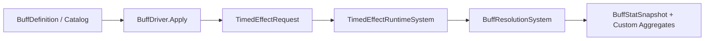

# Buff Subsystem

> **Scheduling:** `BuffRuntimeSystem` lives in `RequestsSystemGroup` (applies requests) and `BuffResolutionSystem` lives in `ResolutionSystemGroup` (rebuilds snapshots). Interact with them only via `BuffDriver`/`BuffFactory`.  
> **Timebase:** Buff durations are seconds (TimedEffect uses `DeltaTime`). Snapshot updates happen once per frame.



### Responsibilities

- Manage buff definitions (`BuffDefinition`, `BuffCatalog`) and authoring metadata.  
- Apply/refresh stacks through `BuffDriver`, which forwards to the Timed Effect engine.  
- Aggregate stat effects into `BuffStatSnapshot` + optional `BuffCustomStatAggregate` buffers.

### Key types

| Type | Purpose |
| --- | --- |
| `BuffDefinition` / `BuffStatEffect` | Authoring data describing stacking, duration, and stat deltas. |
| `BuffCatalog` | Shared static map of registered definitions. |
| `BuffDriver` | High-level API to apply buff IDs to targets. |
| `BuffInstance` | Per-entity buffer storing stat effect payloads for active buffs. |
| `BuffStatSnapshot` | Frame-to-frame aggregate used by damage/resources/stats subsystems. |
| `BuffResolutionSystem` | Consumes TimedEffect state, updates snapshots, and prunes stale data. |

### Units & invariants

- All durations are seconds. Stack counts are integers ≥ 1.  
- Stat effects follow the `(Base + Additive) * Multiplier` convention; keep additive units consistent with their destination stats.  
- Custom aggregates use `FixedString32Bytes` IDs so other systems can look them up quickly.

### Buffer ownership & lifetime

- `BuffInstance` buffers live on the buffed entity. `BuffDriver` ensures they exist and refreshes entries.  
- `BuffStatSnapshot`/`BuffCustomStatAggregate` components are owned by `BuffResolutionSystem`, which adds/removes them automatically based on active buffs.  
- TimedEffect buffers drive the timing; do not manually adjust `BuffInstance` lifetimes.

### Telemetry hooks

- Emit analytics when buffs are applied/removed inside systems that call `BuffDriver` (e.g., spells, AI).  
- For snapshot-level metrics (e.g., “average haste %”), read `BuffStatSnapshot` in a `TelemetrySystemGroup` system.

### Performance notes

- Catalog lookups use burst-friendly `UnsafeHashMap`. Register definitions at startup to avoid runtime allocations.  
- Snapshot rebuilds iterate only over entities with active buff timed effects; keep definitions tight to avoid large `FixedList` payloads.  
- If you add custom stat aggregates, keep them small (≤128 entries) to preserve cache locality.

### Example: Registering and applying a buff

```csharp
using Framework.Buffs.Content;
using Framework.Buffs.Drivers;

void RegisterRage()
{
    var def = new BuffDefinition
    {
        Id = (FixedString64Bytes)"rage",
        StackingMode = BuffStackingMode.RefreshDuration,
        MaxStacks = 5,
        DurationPolicy = BuffDurationPolicy.Fixed,
        Duration = 12f
    };
    def.StatEffects.Add(new BuffStatEffect
    {
        Kind = BuffStatEffectKind.DamageMultiplier,
        MultiplierPerStack = 1.05f
    });
    BuffCatalog.Register(in def);
}

void ApplyRage(ref EntityManager em, Entity target)
{
    if (!em.Exists(target))
        return;

    BuffDriver.Apply(ref em, target, (FixedString64Bytes)"rage", duration: 12f, stacks: 1);
}
```

### Example: Reading aggregated buff stats

```csharp
bool TryGetDamageMultiplier(EntityManager em, Entity entity, out float multiplier)
{
    multiplier = 1f;
    if (!em.HasComponent<Framework.Buffs.Components.BuffStatSnapshot>(entity))
        return false;

    multiplier = em.GetComponentData<Framework.Buffs.Components.BuffStatSnapshot>(entity).DamageMultiplier;
    return true;
}
```

Use `BuffCustomStatAggregate` buffers when you need custom stat IDs (e.g., “berserk-meter”).

### Detailed example: multi-buff pipeline

Goal: A combo aura applies two buffs—`battle-haste` (haste% + regen) and `stone-skin` (ward + defense)—and removes them when the aura ends.

```csharp
void ApplyComboAura(ref EntityManager em, NativeArray<Entity> targets, float duration)
{
    for (int i = 0; i < targets.Length; i++)
    {
        var target = targets[i];
        if (!em.Exists(target))
            continue;

        BuffDriver.Apply(ref em, target, (FixedString64Bytes)"battle-haste", duration, stacks: 1);
        BuffDriver.Apply(ref em, target, (FixedString64Bytes)"stone-skin", duration, stacks: 1);
    }
}

void RemoveComboAura(ref EntityManager em, Entity target)
{
    if (!em.HasBuffer<TimedEffectRequest>(target))
        return;

    var requests = em.GetBuffer<TimedEffectRequest>(target);
    requests.Add(new TimedEffectRequest
    {
        Target = target,
        EffectId = (FixedString64Bytes)"battle-haste",
        Type = TimedEffectType.Buff,
        Duration = 0f
    });
    requests.Add(new TimedEffectRequest
    {
        Target = target,
        EffectId = (FixedString64Bytes)"stone-skin",
        Type = TimedEffectType.Buff,
        Duration = 0f
    });
}
```

Because `BuffResolutionSystem` rebuilds the snapshot every frame, both buffs automatically contribute to haste %, regen, ward, and defense multipliers without any additional glue code.

### See also

- [`TimedEffect.md`](TimedEffect.md) – underlying timer/stacking logic.  
- [`Stats.md`](Stats.md) – how snapshots influence stat calculations.  
- [`Damage.md`](Damage.md) / [`Resources.md`](Resources.md) – downstream systems that read snapshots.  
- [`Spells.md`](Spells.md) – driver usage from the spell pipeline.  
- [`Temporal.md`](Temporal.md) – haste/slow buffs affecting other subsystems.
