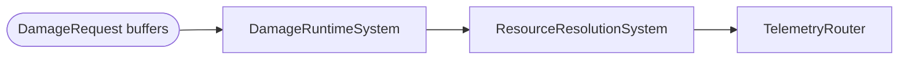

# Damage Subsystem

> **Scheduling:** Runs in `Framework.Core.Base.RuntimeSystemGroup` (order-first). Always enqueue work via `DamageFactory`; consumers should only read `Framework.Resources.Components.Health` after the Resolution phase.  
> **Timebase:** Uses `SystemAPI.Time.ElapsedTime` for telemetry timestamps while mitigation math is pure (no `DeltaTime`). All damage amounts are integers.



### Responsibilities

- Encapsulate damage intent (`DamagePacket`) and queue processing (`DamageRequest` buffers).  
- Apply mitigation via `DamagePolicy` (armor/resist) and `BuffStatSnapshot`.  
- Handle reflection/telemetry inside `DamageRuntimeSystem`.

### Key types

| Type | Purpose |
| --- | --- |
| `DamagePacket` | Raw amount, school, crit multiplier, bypass flags, source entity. |
| `DamageFactory` | Ensures `DamageRequest` buffers exist and appends packets. |
| `DamageDriver` | Convenience method for rare direct applications. |
| `DamageRuntimeSystem` | Resolves mitigation and applies health deltas. |
| `DamageResolverUtility` | Shared mitigation + reflection helper used by runtime/tests. |
| `DamagePolicy` | Burst functions for armor-only or armor+resist curves. |

### Units & invariants

- All damage amounts are signed `int` values; clamp to ≥0 before enqueueing.  
- Schools (`DamageSchool`) gate downstream modifiers; keep them in sync with spell definitions.  
- Variance/crit math should run **before** mitigation so logs remain deterministic.  
- Time references (cooldowns, telemetry) rely on `ElapsedTime`; do not mix `UnityEngine.Time.time`.

### Buffer ownership & lifetime

- `DamageRequest` buffers live on the target entity. `DamageRuntimeSystem` owns clearing them each frame.  
- Producers **must** call `DamageFactory.EnqueueDamage`; never add the buffer manually because the factory enforces structural safety.  
- `Damageable`, `BuffStatSnapshot`, and `Health` are read-only inputs—runtime never destroys them.

### Canonical order of operations

1. Apply variance/crit to the raw amount.  
2. Apply snapshot modifiers (`BuffStatSnapshot.DefenseMultiplier`).  
3. Apply bypass flags (armor/resist) as described in [`Damage.BypassFlags.md`](Damage.BypassFlags.md).  
4. Apply `DamagePolicy.Mitigate` (armor first, resist second).  
5. Apply reflection/ward logic (writes new requests to attackers).  
6. Subtract from `Health` and emit telemetry.

### Telemetry hooks

- `DamageRuntimeSystem` emits `DamageApplied` and `DamageReflected` tags via `TelemetryRouter`.  
- Add additional counters in a `TelemetrySystemGroup` system that reads summarized values (never inside gameplay-critical code).  
- Enable verbose logging in development builds with `DamageDebugBridge.EnableDebugLogs(true)`.

### Performance notes

- Buffer traversal is O(#targets with pending requests). Keep requests compact by batching multiple packets for the same target.  
- `DamageResolverUtility` is Burst-compatible; avoid allocating strings in tight loops (use `FixedString64Bytes`).  
- Large AoE spells should pre-sort targets to avoid repeated cache misses.

### Example: Enqueuing packet-based damage

```csharp
using Framework.Damage.Components;
using Framework.Damage.Factory;

void HitTarget(ref EntityManager em, Entity attacker, Entity victim, int rawAmount)
{
    if (!em.Exists(victim))
        return;

    var packet = new DamagePacket
    {
        Amount = math.max(0, rawAmount),
        School = DamageSchool.Fire,
        Source = attacker,
        CritMult = 1.5f,
        Tags = (FixedString64Bytes)"ignite",
        IgnoreArmor = 0,
        IgnoreResist = 0,
        IgnoreSnapshotModifiers = 0
    };

    DamageFactory.EnqueueDamage(ref em, victim, packet);
}
```

### Example: Using bypass flags for a true-strike ability

```csharp
void ApplyTrueStrike(ref EntityManager em, Entity attacker, Entity victim)
{
    if (!em.Exists(victim))
        return;

    var packet = new DamagePacket
    {
        Amount = 200,
        School = DamageSchool.Physical,
        Source = attacker,
        CritMult = 1f,
        IgnoreArmor = 1,
        IgnoreResist = 1,
        IgnoreSnapshotModifiers = 1,
        Tags = (FixedString64Bytes)"bleed,execute"
    };

    DamageFactory.EnqueueDamage(ref em, victim, packet);
}
```

### Detailed example: spell-to-damage pipeline

This walkthrough shows how a spell block ultimately alters `Health`:

1. **Spell payload** configures a `DamagePayload` (optionally with bypass flags).  
2. `EffectBlockRouter` converts it into a `DamagePacket` and calls `DamageFactory.EnqueueDamage`.  
3. `DamageRuntimeSystem` gathers armor (`Damageable`), snapshots, and reflection data.  
4. The mitigated amount subtracts from `Health`; reflection enqueues secondary packets if needed.

```csharp
// Step 1 — authoring (partial)
builder.AddEffect(
    TargetScope.Single(TargetScopeKind.PrimaryTarget),
    new EffectPayload
    {
        Kind = EffectPayloadKind.Damage,
        Damage = new DamagePayload
        {
            School = DamageSchool.Holy,
            Amount = 450,
            VariancePercent = 5f,
            IgnoreArmor = 1
        }
    });

// Step 2 — router (simplified; RollCrit stubbed for docs)
var packet = new DamagePacket
{
    Amount = final,
    School = block.Payload.Damage.School,
    Source = ctx.Caster,
    CritMult = block.Payload.Damage.CanCrit != 0 ? RollCrit(ctx.RandomSeed) : 1f,
    IgnoreArmor = block.Payload.Damage.IgnoreArmor,
    IgnoreResist = block.Payload.Damage.IgnoreResist,
    IgnoreSnapshotModifiers = block.Payload.Damage.IgnoreSnapshotModifiers
};
DamageFactory.EnqueueDamage(ref ctx.EntityManager, target, packet);

// Step 3+4 — runtime excerpt
int mitigated = DamageResolverUtility.Resolve(entity, packet, armor, resist, hasSnapshot, snapshot);
long next = math.max(0, (long)health.Current - mitigated);
health.Current = (int)next;
```

_(Utilities like `RollCrit` are stubbed for documentation purposes.)_

### See also

- [`Damage.BypassFlags.md`](Damage.BypassFlags.md) – flag table + debug tips.  
- [`Resources.md`](Resources.md) – how health/mana components store results.  
- [`TimedEffect.md`](TimedEffect.md) / [`DamageOverTime.md`](DamageOverTime.md) – continuous damage sources.  
- [`Spells.md`](Spells.md) – how payloads feed the damage pipeline.  
- [`Heal.md`](Heal.md) – telemetry symmetry for healing events.
