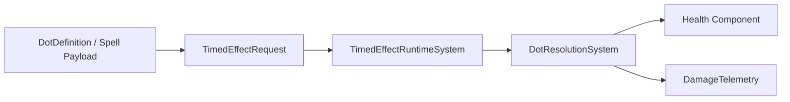

# Damage Over Time (DOT) Subsystem

> **Scheduling:** `DotResolutionSystem` runs inside `Framework.Core.Base.ResolutionSystemGroup`. Produce DOTs via `DotFactory` requests; never reference the system directly.  
> **Timebase:** `TickInterval`/`Duration` use **seconds** and rely on `SystemAPI.Time.DeltaTime` for countdowns. Telemetry timestamps use `SystemAPI.Time.ElapsedTime`.



### Responsibilities

- Register DOT definitions (tick interval, DPS, duration) and expose runtime overrides.  
- Handle DOT application from spells/features via `DotFactory`.  
- Resolve tick events, apply mitigation, and subtract health in `DotResolutionSystem`.

### Key types

| Type | Purpose |
| --- | --- |
| `DotDefinition` / `DotCatalog` | Authoring data + lookup for prebuilt DOTs. |
| `DotFactory` | Enqueues `TimedEffectRequest`s and maintains `DotInstance` buffers. |
| `DotInstance` | Stores effect ID, DPS per tick, and source entity. |
| `DotResolutionSystem` | Listens to `TimedEffectEvent` buffers, computes total damage, applies mitigation. |

### Units & invariants

- `DamagePerTick` is an integer; the runtime multiplies by stack and tick counts.  
- `TickInterval` must be > 0.0 seconds; `Duration` can be 0 (instant removal).  
- DOTs respect TimedEffect categories/stacking rules—set `StackableCount`/`CategoryId` accordingly.

### Buffer ownership & lifetime

- `DotInstance` buffers live on affected entities and are owned by `DotFactory`.  
- `DotResolutionSystem` removes the buffer when no DOTs remain.  
- `TimedEffectEvent` buffers are shared with HOT/Buff systems; each consumer removes the events it processes.

### Telemetry hooks

- Record per-tick totals right before subtracting health, then emit `TelemetryRouter` tags like `DotTickDamage`.  
- Mirror aggregate damage in a `TelemetrySystemGroup` system to avoid mixing analytics with Burst-critical loops.  
- Enable `DamageDebugBridge` to dump DOT mitigation details during development.

### Performance notes

- Runtime cost scales with the number of active DOT targets, not world size.  
- Prefer catalog IDs instead of generating unique IDs unless per-caster tracking is required.  
- Keep DPS moderate to avoid integer overflow when stacking many ticks per frame.

### Example: Registering and applying a DOT

```csharp
using Framework.DOT.Content;
using Framework.DOT.Factory;

void RegisterBurn()
{
    DotCatalog.Register(new DotDefinition
    {
        Id = (FixedString64Bytes)"burn",
        TickInterval = 1f,
        Dps = 35,
        Duration = 8f
    });
}

void ApplyBurn(ref EntityManager em, Entity caster, Entity target)
{
    if (!em.Exists(target))
        return;

    DotFactory.Enqueue(ref em, target, (FixedString64Bytes)"burn", dps: 35, interval: 1f, duration: 8f, source: caster);
}
```

### Example: Spawning DOTs from spell payloads

```csharp
builder.AddEffect(
    TargetScope.Single(TargetScopeKind.PrimaryTarget),
    new EffectPayload
    {
        Kind = EffectPayloadKind.SpawnDot,
        OverTime = new DotHotPayload
        {
            Id = (FixedString64Bytes)"burn",
            UseCatalogDefaults = 1
        }
    });
```

`EffectBlockRouter` automatically routes the payload to `DotFactory`.

### Mitigation flow

1. `TimedEffectEvent` ticks accumulate total damage = `DamagePerTick * max(1, StackCount) * max(1, TickCount)`.  
2. `DotResolutionSystem` reads `Damageable` (if present) and calls `DamagePolicy.Mitigate`.  
3. Snapshot modifiers (`BuffStatSnapshot`) and reflection logic run via `DamageResolverUtility`.  
4. Health is reduced, telemetry fires, and DOT buffers are pruned if empty.

### Detailed example: stacking DOTs from multiple casters

DOTs are scoped per target + effect ID. To let multiple casters apply independent stacks while keeping log output readable, bake the caster index/version into the ID:

```csharp
void ApplyStackablePoison(ref EntityManager em, Entity caster, Entity target, int dps, float duration)
{
    if (!em.Exists(target))
        return;

    var effectId = (FixedString64Bytes)$"poison-{caster.Index}-{caster.Version}";
    DotFactory.Enqueue(ref em, target, effectId, dps, interval: 1.5f, duration, source: caster);
}
```

During `DotResolutionSystem` we still know the original caster (`DotInstance.Source`). That means reflection or aggro logic can attribute damage correctly per attacker even though the user-facing DOT name is identical (“Poison”).

### See also

- [`TimedEffect.md`](TimedEffect.md) – shared request/event infrastructure.  
- [`Temporal.md`](Temporal.md) – haste/slow scaling.  
- [`Damage.md`](Damage.md) – mitigation details.  
- [`HealOverTime.md`](HealOverTime.md) – symmetric HOT subsystem.  
- [`Spells.md`](Spells.md) – payload authoring for DOTs.
