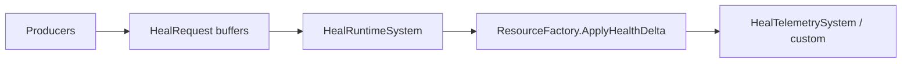

# Heal Subsystem

> **Scheduling:** `HealRuntimeSystem` runs in `RequestsSystemGroup`. Always enqueue via `HealFactory`; never consume the buffers outside that system.  
> **Timebase:** Heals are instantaneous (no DeltaTime math). Telemetry timestamps rely on `SystemAPI.Time.ElapsedTime`.



### Responsibilities

- Queue heal intents via `HealRequest` buffers.  
- Apply clamped health deltas through `HealDriver` (delegates to `ResourceFactory`).  
- Emit telemetry tags for analytics/debugging.

### Key types

| Type | Purpose |
| --- | --- |
| `HealRequest` | Buffer element storing `(Target, Amount)`. |
| `HealFactory` | Adds/clears buffers and appends heal requests. |
| `HealDriver` | Direct (non-buffered) application helper. |
| `HealRuntimeSystem` | Consumes requests and calls the driver each frame. |

### Units & invariants

- Heal amounts are positive integers (pass negative values only when intentionally applying reverse effects).  
- Heals clamp to `Health.Max` via `ResourceFactory`—no special handling required in gameplay code.  
- HoTs use `HealOverTime`; this subsystem handles only instant deltas.

### Buffer ownership & lifetime

- Each target owns its `HealRequest` buffer. `HealFactory.EnqueueHeal` lazily adds it.  
- `HealRuntimeSystem` clears the buffer after processing to prevent double-counting.  
- Direct `HealDriver.Apply` calls are allowed only when you have already validated entity existence and are outside Burst jobs.

### Telemetry hooks

- `HealRuntimeSystem` is the best point to measure overheal before buffers clear.  
- Use a follow-up system in `TelemetrySystemGroup` to batch-send analytics to UI/network.  
- `HealTelemetryBridge` in the example is a doc stub—replace it with your telemetry gateway.

### Performance notes

- Healing typically touches fewer entities per frame than damage, but still batch requests per target to avoid structural changes.  
- Keep telemetry logging optional to avoid GC allocations in release builds.  
- HoT systems (see `HealOverTime.md`) should not duplicate logic—route through `ResourceFactory`.

### Example: Buffering an instant heal

```csharp
using Framework.Heal.Factory;

void CastFlashHeal(ref EntityManager em, Entity healer, Entity target)
{
    if (!em.Exists(target))
        return;

    HealFactory.EnqueueHeal(ref em, target, amount: 420);
}
```

### Example: Direct heal application from authoring utilities

```csharp
using Framework.Heal.Drivers;

bool TryInstantlyHeal(ref EntityManager em, Entity target, int amount)
{
    if (!em.Exists(target))
        return false;

    HealDriver.Apply(ref em, target, math.max(0, amount));
    return true;
}
```

_Use the direct driver only outside jobs and when the entity’s lifetime is already validated._

### Detailed example: heal + overheal telemetry

1. Queue all heals through `HealFactory` so the runtime batches writes.  
2. Measure overheal right after applying the delta.  
3. Mirror telemetry in a `TelemetrySystemGroup` system so gameplay logic stays Burst-safe.

```csharp
[UpdateInGroup(typeof(Framework.Core.Base.RuntimeSystemGroup))]
public partial struct HealRuntimeSystem : ISystem
{
    public void OnUpdate(ref SystemState state)
    {
        var em = state.EntityManager;
        foreach (var (requests, entity) in SystemAPI.Query<DynamicBuffer<HealRequest>>().WithEntityAccess())
        {
            for (int i = 0; i < requests.Length; i++)
            {
                var req = requests[i];
                if (!em.Exists(req.Target))
                    continue;

                var before = em.GetComponentData<Framework.Resources.Components.Health>(req.Target);
                HealDriver.Apply(ref em, req.Target, req.Amount);
                var after = em.GetComponentData<Framework.Resources.Components.Health>(req.Target);
                int overheal = math.max(0, (before.Current + req.Amount) - before.Max);
                HealTelemetryBridge.Record(req.Target, req.Amount, overheal);
            }
            requests.Clear();
        }
    }
}
```

_`HealTelemetryBridge` is a doc placeholder for your analytics sink._

### See also

- [`Resources.md`](Resources.md) – health component definitions.  
- [`HealOverTime.md`](HealOverTime.md) – sustained healing via timed effects.  
- [`Spells.md`](Spells.md) – how spell steps enqueue heals.  
- [`Damage.md`](Damage.md) – parallel telemetry patterns for damage events.
