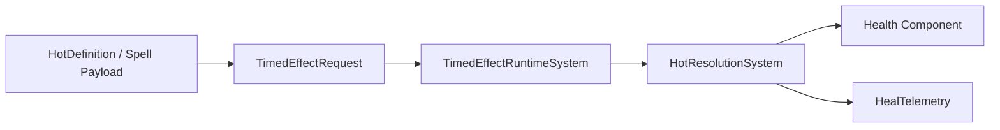

# Heal Over Time (HOT) Subsystem

> **Scheduling:** `HotResolutionSystem` runs in `Framework.Core.Base.ResolutionSystemGroup`. Producers enqueue via `HotFactory`; do not depend on the system directly.  
> **Timebase:** `TickInterval`/`Duration` are **seconds** (`SystemAPI.Time.DeltaTime`), while telemetry uses `ElapsedTime`.



### Responsibilities

- Register HOT definitions (tick interval, HPS, duration) or accept runtime overrides.  
- Apply HOTs via `HotFactory` (spells, temporal release, scripted features).  
- Listen for TimedEffect tick events and add health until the effect expires.

### Key types

| Type | Purpose |
| --- | --- |
| `HotDefinition` / `HotCatalog` | Authoring data + lookup map. |
| `HotFactory` | Enqueues TimedEffect requests and maintains `HotInstance` buffers. |
| `HotInstance` | Stores effect ID, heal per tick, and source entity. |
| `HotResolutionSystem` | Reads tick events, sums heal values, clamps to `Health.Max`. |
| `TemporalReleaseHotSystem` | Converts temporal release results into HOT requests. |

### Units & invariants

- Heal-per-tick values are integers.  
- Tick interval/duration are floats in seconds; keep them positive to avoid division issues.  
- HOTs obey TimedEffect category/stack rules—set `StackableCount` to limit concurrent effects.

### Buffer ownership & lifetime

- Targets own their `HotInstance` buffers. `HotFactory` updates them in-place and removes duplicates.  
- `HotResolutionSystem` removes the buffer when no HOTs remain.  
- `TemporalReleaseHotSystem` only writes `TimedEffectRequest`s and optional `TemporalReleaseResult`s; it never touches HOT buffers directly.

### Telemetry hooks

- Mirror per-tick heal totals to `HealTelemetrySystem` (or a custom telemetry system) immediately after clamping to `Health.Max`.  
- Track overheal by comparing the requested tick amount vs. actual health delta.  
- Keep telemetry outside Burst-critical loops when possible.

### Performance notes

- HOT processing mirrors DOT cost: proportional to active HOT targets.  
- Use catalog IDs for shared effects and optional caster suffixes only when attribution matters.  
- Temporal release HoTs reuse the same pipeline, so there’s no special-case logic to maintain.

### Example: Manual HOT application

```csharp
using Framework.HOT.Factory;

void ApplyRegrowth(ref EntityManager em, Entity caster, Entity target)
{
    if (!em.Exists(target))
        return;

    HotFactory.Enqueue(ref em, target, (FixedString64Bytes)"regrowth", hps: 55, interval: 2f, duration: 12f, source: caster);
}
```

### Example: HOT payload in spells

```csharp
builder.AddEffect(
    TargetScope.Single(TargetScopeKind.PrimaryTarget),
    new EffectPayload
    {
        Kind = EffectPayloadKind.SpawnHot,
        OverTime = new DotHotPayload
        {
            Id = (FixedString64Bytes)"regrowth",
            DurationOverride = 10f,
            TickIntervalOverride = 1f,
            MagnitudeOverride = 40
        }
    });
```

### Temporal release integration

`TemporalReleaseHotSystem` iterates `TemporalReleaseResult` buffers, converts total heal amount into integer ticks, and calls `HotFactory.Enqueue` per target. This keeps temporal mechanics fully data-driven without extra bespoke code in HOT authoring.

### Detailed example: raid-wide regen aura

1. **Start** – when the aura buff is applied, iterate the party list and enqueue HOTs with the same `EffectId` but different `Source` so logs stay readable.  
2. **Refresh** – reapply the same `EffectId` with `DurationOverride` to refresh timers without re-adding instances.  
3. **Stop** – remove the TimedEffect entry by pushing a `TimedEffectRequest` with `Duration = 0f`.

```csharp
void ApplyRegenAura(ref EntityManager em, Entity caster, NativeArray<Entity> party, float duration, int hps)
{
    var effectId = (FixedString64Bytes)"raid-regen";
    for (int i = 0; i < party.Length; i++)
    {
        var member = party[i];
        HotFactory.Enqueue(ref em, member, effectId, hps, interval: 1f, duration, source: caster);
    }
}

void CancelRegenAura(ref EntityManager em, NativeArray<Entity> party)
{
    var effectId = (FixedString64Bytes)"raid-regen";
    for (int i = 0; i < party.Length; i++)
    {
        var member = party[i];
        if (!em.HasBuffer<TimedEffectRequest>(member))
            continue;

        em.GetBuffer<TimedEffectRequest>(member).Add(new TimedEffectRequest
        {
            Target = member,
            EffectId = effectId,
            Type = TimedEffectType.HealOverTime,
            Duration = 0f
        });
    }
}
```

### Per-caster stacking tip

Need separate HOT stacks per caster? Use the caster index/version in the effect ID just like DOTs:

```csharp
var effectId = (FixedString64Bytes)$"renew-{caster.Index}-{caster.Version}";
HotFactory.Enqueue(ref em, target, effectId, hps, interval, duration, source: caster);
```

### See also

- [`TimedEffect.md`](TimedEffect.md) – shared request/event infrastructure.  
- [`Temporal.md`](Temporal.md) – haste/slow scaling.  
- [`Resources.md`](Resources.md) – health clamping behavior.  
- [`Heal.md`](Heal.md) – instant heals + telemetry.  
- [`DamageOverTime.md`](DamageOverTime.md) – DOT counterpart.  
- [`Spells.md`](Spells.md) – payload authoring for HOTs.
