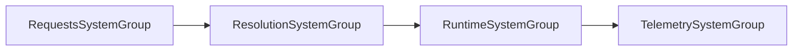

# Shared Lifecycle & Bootstrap



Every subsystem plugs into the same four-phase simulation skeleton defined in `Framework.Core.Base.Groups`:

1. **Requests** – enqueue intent into dynamic buffers/components.  
2. **Runtime** – consume those buffers and run gameplay logic through drivers and factories (safe `EntityManager` writes live in those helpers).  
3. **Resolution** – tick long-running state (regen, timers, DOT/HOT damage, cooldown decay).  
4. **Telemetry** – emit analytics events or debug counters after gameplay finishes for the frame.

## Registering systems safely

- Mark all `ComponentSystemGroup` and `SystemBase` derivatives as `partial`; Entities source generators require it.  
- Use `Framework.Core.Base.SystemRegistration.RegisterISystemInGroups<T>()` when adding unmanaged `ISystem` types.  
- For managed groups, use `SystemRegistration.RegisterManagedSystemInGroups<T>()`.

```csharp
using Framework.Core.Base;
using Unity.Entities;

public sealed class ExampleSubsystemManifest : ISubsystemManifest
{
    public void Register(World world, EntityManager em)
    {
        SystemRegistration.RegisterISystemInGroups<ExampleRequestSystem>(world);
        SystemRegistration.RegisterISystemInGroups<ExampleResolutionSystem>(world);
    }
}

[UpdateInGroup(typeof(RequestsSystemGroup))]
public partial struct ExampleRequestSystem : ISystem
{
    public void OnUpdate(ref SystemState state)
    {
        // enqueue buffers or passive data writes here
    }
}
```

## Bootstrapping in worlds

`Framework.Core.Base.SubsystemBootstrap.InstallAll(world)` finds subsystem manifests in the current AppDomain. If the CombatSystem aggregator is present, it delegates to `Framework.CombatSystem.Bootstrap.SubsystemManifestRegistry.Build`. Otherwise it instantiates the fallback manifest list inside `SubsystemBootstrap`.

`SpellPipelineFactory.Cast` calls `SubsystemBootstrap.InstallAll` automatically the first time you issue a cast in a world. For headless tests or custom worlds, call it manually right after `DefaultWorldInitialization.AddSystemsToRootLevelSystemGroups`.

## Scheduling work inside groups

When you need ordering, depend on the framework groups instead of concrete systems in other asmdefs:

```csharp
[UpdateInGroup(typeof(Framework.Core.Base.ResolutionSystemGroup))]
[UpdateAfter(typeof(Framework.Resources.Resolution.ResourceResolutionSystem))]
public partial struct ArmorRegenSystem : ISystem
{
    public void OnUpdate(ref SystemState state)
    {
        foreach (var armor in SystemAPI.Query<RefRW<Framework.Damage.Components.Damageable>>())
        {
            var value = armor.ValueRW;
            value.Armor++;
            armor.ValueRW = value;
        }
    }
}
```

The group attribute keeps scheduling deterministic without cross-asmdef type references, which satisfies the DOTS asmdef checklist described in `AGENTS.md`.

## Detailed example: bringing a custom subsystem online

The snippet below shows a minimal but complete flow that:

1. Defines a new subsystem manifest and request/runtime/resolution systems.
2. Registers it inside the fallback manifest array (or your CombatSystem aggregator).
3. Verifies the systems run in the expected order via debug logs.

```csharp
// 1. System implementations
[UpdateInGroup(typeof(RequestsSystemGroup))]
public partial struct ShieldRequestSystem : ISystem
{
    public void OnUpdate(ref SystemState state)
    {
        foreach (var shield in SystemAPI.Query<RefRW<ShieldComponent>>())
        {
            if (shield.ValueRW.PendingRecharge == 0)
                continue;
            shield.ValueRW.PendingRecharge--;
            // runtime system consumes this later
        }
    }
}

[UpdateInGroup(typeof(RuntimeSystemGroup))]
[UpdateAfter(typeof(ShieldRequestSystem))]
public partial struct ShieldRuntimeSystem : ISystem
{
    public void OnUpdate(ref SystemState state)
    {
        foreach (var shield in SystemAPI.Query<RefRW<ShieldComponent>>())
        {
            if (shield.ValueRW.PendingRecharge > 0)
                continue;
            shield.ValueRW.Value = math.min(shield.ValueRW.Value + 5, shield.ValueRW.Max);
        }
    }
}

[UpdateInGroup(typeof(ResolutionSystemGroup))]
public partial struct ShieldResolutionSystem : ISystem
{
    public void OnUpdate(ref SystemState state)
    {
        foreach (var shield in SystemAPI.Query<RefRW<ShieldComponent>>())
        {
            shield.ValueRW.Value = math.clamp(shield.ValueRW.Value, 0, shield.ValueRW.Max);
        }
    }
}

// 2. Manifest registration
public sealed class ShieldSubsystemManifest : ISubsystemManifest
{
    public void Register(World world, EntityManager em)
    {
        SystemRegistration.RegisterISystemInGroups<ShieldRequestSystem>(world);
        SystemRegistration.RegisterISystemInGroups<ShieldRuntimeSystem>(world);
        SystemRegistration.RegisterISystemInGroups<ShieldResolutionSystem>(world);
    }
}

// 3. Startup
public static class GameBootstrap
{
    [RuntimeInitializeOnLoadMethod(RuntimeInitializeLoadType.AfterAssembliesLoaded)]
    static void Install()
    {
        var world = World.DefaultGameObjectInjectionWorld;
        Framework.Core.Base.SubsystemBootstrap.InstallAll(world);
    }
}
```

Because the systems rely exclusively on the shared groups they remain order-stable across asmdefs, Burst-friendly, and easy to test in isolation.

### See also

- [`Temporal.md`](Temporal.md) – haste/slow impacts across groups.  
- [`Spells.md`](Spells.md) – pipeline touching multiple phases.  
- [`Damage.md`](Damage.md) / [`Heal.md`](Heal.md) – examples of request-driven subsystems.
