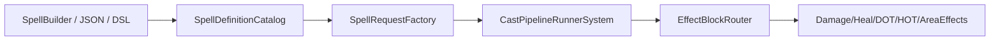

# Spells Subsystem

> **Scheduling:** The spell pipeline touches multiple groups: `RequestsSystemGroup` handles request queues/validation, `RuntimeSystemGroup` runs pipeline stages, and downstream systems (Damage, DOT, Resources) run in Resolution. Always interact through `SpellPipelineFactory` or `SpellRequestFactory`.  
> **Timebase & units:** Cast times/cooldowns are seconds (ElapsedTime). Targeting distances match your world units (meters). Angles in payloads are degrees.



The spells stack combines content authoring (definitions) and runtime orchestration (pipeline). Designers can create spells three ways:

1. **`SpellBuilder` fluent API** - ideal for C# bootstrap or tests.  
2. **JSON/DSL ingestion** - see `Framework/Spells/Content/SpellDefinition.cs` and the extended examples in `Framework/Docs/Spells/Examples.md`.  
3. **Runtime patching** - modify plan steps or inject script features via `SpellPipelineFactory` and `SpellCastPlanModifier`.

### Buffer ownership & lifetime

- `DynamicBuffer<SpellCastRequest>` lives on the caster and is cleared by the pipeline per frame.  
- `DynamicBuffer<SpellCastPlanModifier>` stores temporary plan edits; clear it via `SpellPipelineFactory.ClearOverrides` after use.  
- Effect payloads never mutate shared state directly—call into subsystem factories (DamageFactory, HotFactory, etc.).

### Spell cost & validation order

1. **Cooldown check** (via `CooldownDriver`).  
2. **Resource affordability** (Consumes resources via `ResourceAccessUtility`).  
3. **Target validation** (range/LOS via `EffectTargetResolver`).  
4. **Spend** (resources + cooldowns).  
5. **Execute** (router dispatches payloads).  
6. **Cleanup** (telemetry, plan modifier removal).

## Core pieces

| Piece | Purpose |
| --- | --- |
| `SpellDefinition` / `SpellDefinitionCatalog` | Data describing costs, target scopes, effect blocks, and metadata. |
| `SpellBuilder` | Fluent helper to compose `SpellDefinition` instances in code. |
| `SpellRequestFactory` / `SpellPipelineFactory` | Enqueue casts, append/insert/remove plan steps, enable debug logs. |
| `SpellbookDriver` | Manages a unit’s known spells and slot assignments. |
| `EffectBlockRouter` | Resolves targets and dispatches payloads (damage, heal, buff, DOT/HOT, area effects, scripts). |
| `SpellCastPlanModifier` | Buffer of operations (append/insert/remove) processed by `CastPlanBuilderSystem`. |

## Authoring spells with `SpellBuilder`

```csharp
using Framework.Spells.Factory;
using Framework.Spells.Content;

void RegisterFireball()
{
    var builder = SpellBuilder.NewSpell((FixedString64Bytes)"spell.fireball")
        .SetSchool(SpellSchool.Fire)
        .SetCastTime(2.0f)
        .SetCooldown(6f)
        .SetRange(35f)
        .SetTargeting(SpellTargeting.Hostile)
        .SetManaCost(50);

    builder.AddEffect(
        TargetScope.Single(TargetScopeKind.PrimaryTarget),
        new EffectPayload
        {
            Kind = EffectPayloadKind.Damage,
            Damage = new DamagePayload
            {
                School = Framework.Damage.Components.DamageSchool.Fire,
                Amount = 320,
                VariancePercent = 10f,
                IgnoreArmor = 0,
                IgnoreResist = 0
            }
        });

    builder.AddEffect(
        TargetScope.Radius(TargetScopeCenter.Target, radius: 4f, TargetTeamFilter.Enemy),
        new EffectPayload
        {
            Kind = EffectPayloadKind.SpawnDot,
            OverTime = new DotHotPayload
            {
                Id = (FixedString64Bytes)"burn",
                DurationOverride = 6f,
                TickIntervalOverride = 1f,
                MagnitudeOverride = 25
            }
        });

    builder.Register();
}
```

## Loading definitions from JSON

If you prefer data-driven pipelines, convert JSON or DSL assets into `SpellDefinition` structs and register them:

```csharp
using Framework.Spells.Content;
using Newtonsoft.Json;

void LoadFromJson(string json)
{
    var defs = JsonConvert.DeserializeObject<SpellDefinition[]>(json);
    if (defs == null)
        return;

    for (int i = 0; i < defs.Length; i++)
        SpellDefinitionCatalog.Register(defs[i]);
}
```

See `Framework/Docs/Spells/Examples.md` for schema samples and DSL conventions.

## Enqueueing casts via the pipeline

```csharp
using Framework.Spells.Factory;

void QueueFireball(ref EntityManager em, Entity caster, Entity target)
{
    SpellPipelineFactory.Cast(ref em, caster, target, (FixedString64Bytes)"spell.fireball");
}
```

`SpellPipelineFactory` automatically calls `SubsystemBootstrap.InstallAll(world)` the first time it is used per world, ensuring all subsystems are available.

## Customizing spell plans at runtime

```csharp
using Framework.Spells.Factory;
using Framework.Spells.Pipeline.Components;

void InjectChannelFx(ref EntityManager em, Entity caster)
{
    SpellPipelineFactory.InsertStep(
        ref em,
        caster,
        stepType: CastStepType.Script,
        referenceStep: CastStepType.Windup,
        parameters: CastStepParams.FromScript((FixedString64Bytes)"fx.cast.fireball"),
        insertAfter: true);
}
```

Other plan operations:

- `AppendStep` - add a new stage at the end (e.g., add "ChannelTick").  
- `RemoveStep` - strip stages for experimental builds.  
- `ClearOverrides` - remove the modifiers buffer entirely.

## Sustained drains / toggles

- `SustainedSpellFactory.CastWithSustain(ref em, caster, target, "spell.id", drainPerSecond: 6f, tickIntervalSeconds: 1f)` enqueues the spell and attaches a drain entry to the caster.  
- `SustainedSpellDrainSystem` (Runtime group) spends the resource each tick; if the caster cannot afford the tick it removes the entry, ending the sustain.  
- Call `SustainedSpellFactory.Stop(ref em, caster, "spell.id")` to end the drain when a toggle is deactivated. Defaults to mana; pass `resourceId` for stamina/health drains.

## Script payloads and features

Some spells need bespoke logic (pet summoning, camera shakes, etc.). Use `EffectPayloadKind.ScriptReference` to route control to a DOTS-compatible script:

```csharp
builder.AddEffect(
    TargetScope.Self(),
    new EffectPayload
    {
        Kind = EffectPayloadKind.ScriptReference,
        Script = new ScriptPayload
        {
            FeatureId = (FixedString64Bytes)"feature.spawn.pet",
            Arguments = (FixedString64Bytes)"petId=ember-wolf,count=2"
        }
    });
```

`SpellScriptBridge.TryInvoke` receives the feature ID/arguments and can fan out to C# or Burst jobs without bloating the main pipeline.

## Spellbook management

- Use `SpellbookDriver` to add/remove spells from a unit's spellbook (`DynamicBuffer<SpellSlot>`).  
- `ExampleSpellbookDriver.cs` in `Framework/Spells/Spellbook/Drivers` shows how to sync authoring data into runtime buffers.  
- Pair spellbook updates with cooldown + resource checks for a full playable loop.

### Performance notes

- Cache `FixedString64Bytes` spell IDs to avoid allocations when enqueueing.  
- Enable `SpellDebugLogger.SetEnabled(true)` only in dev builds; it uses strings for readability.  
- Group plan modifiers per caster rather than per spell to reduce dynamic buffer churn.

### See also

- [`Resources.md`](Resources.md) – spell costs/readiness.  
- [`Cooldowns.md`](Cooldowns.md) – gating before casts.  
- [`AreaEffects.md`](AreaEffects.md), [`DamageOverTime.md`](DamageOverTime.md), [`HealOverTime.md`](HealOverTime.md) – common payload targets.  
- [`Damage.md`](Damage.md) / [`Heal.md`](Heal.md) – effect execution endpoints.  
- [`Framework/Docs/Spells/README.md`](../Spells/README.md) – extended DSL/JSON docs.

## Detailed example: multi-stage channel spell

This example demonstrates how to build a channel spell that:

1. Validates resources/cooldowns via the validation stage.  
2. Spends mana upfront via `SpendSpellStageSystem`.  
3. Ticks damage every second during the channel using a custom plan step.  
4. Cleans up when interrupted or completed.

```csharp
const FixedString64Bytes ArcBeamId = (FixedString64Bytes)"spell.arc-beam";

void RegisterArcBeam()
{
    SpellBuilder.NewSpell(ArcBeamId)
        .SetSchool(SpellSchool.Arcane)
        .SetCastTime(0f)
        .SetCooldown(12f)
        .SetTargeting(SpellTargeting.Hostile)
        .SetManaCost(60)
        .AddEffect(
            TargetScope.Single(TargetScopeKind.PrimaryTarget),
            new EffectPayload
            {
                Kind = EffectPayloadKind.SpawnDot,
                OverTime = new DotHotPayload
                {
                    Id = (FixedString64Bytes)"arc-beam-dot",
                    MagnitudeOverride = 75,
                    TickIntervalOverride = 1f,
                    DurationOverride = 4f
                }
            })
        .Register();
}

void BeginArcBeam(ref EntityManager em, Entity caster, Entity target)
{
    SpellPipelineFactory.AppendStep(
        ref em,
        caster,
        CastStepType.Script,
        CastStepParams.FromScript((FixedString64Bytes)"feature.channel.lock"));

    SpellPipelineFactory.Cast(ref em, caster, target, ArcBeamId);
}
```

Inside `feature.channel.lock` you can tag the caster and hold them in place while the DOT ticks:

```csharp
public struct ChannelingState : IComponentData
{
    public Entity Target;
    public FixedString64Bytes SpellId;
    public float Duration;
}

public static class ChannelLockFeature
{
    public static void Run(ref EntityManager em, in Entity caster, in Entity target, in SpellRuntimeMetadata metadata)
    {
        if (!em.HasComponent<ChannelingState>(caster))
            em.AddComponentData(caster, new ChannelingState());

        var state = em.GetComponentData<ChannelingState>(caster);
        state.Target = target;
        state.SpellId = metadata.SpellId;
        state.Duration = 4f;
        em.SetComponentData(caster, state);
    }
}
```

- A `ChannelingSystem` (runtime group) decrements `Duration`, cancels the spell if the caster moves, and removes `ChannelingState` once completed.  
- When the DOT ends (TimedEffect removes `arc-beam-dot`), the cleanup stage runs; clear plan modifiers with `SpellPipelineFactory.ClearOverrides(ref em, caster)` if you added temporary steps.  
- Pair this with cooldown/resource checks to ensure the caster cannot instantly recast while channels are active.
