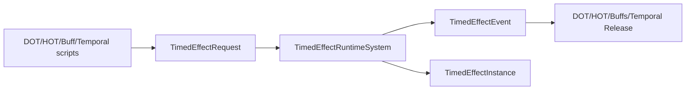

# Timed Effect Engine

> **Scheduling:** `TimedEffectRuntimeSystem` runs in `Framework.Core.Base.RuntimeSystemGroup`. It is the single source of truth for time-based gameplay; producers enqueue `TimedEffectRequest`s and consumers read `TimedEffectEvent`s/buffers.  
> **Timebase:** Durations and tick intervals are **seconds** (`SystemAPI.Time.DeltaTime`). Events carry timestamps relative to `SystemAPI.Time.ElapsedTime`.



### Responsibilities

- Provide a generic system for time-based gameplay: buffs, DOT, HOT, temporal releases, etc.  
- Handle stacking policies, category exclusivity, ticking, and removal events.

### Key types

| Type | Purpose |
| --- | --- |
| `TimedEffectRequest` | Buffer element describing an effect to start or modify. |
| `TimedEffectInstance` | Runtime state (duration, stack count, tick timers, category info). |
| `TimedEffectEvent` | Output buffer detailing `Added`, `Tick`, `StackChanged`, `Removed`, etc. |
| `TimedEffectRuntimeSystem` | Consumes requests, updates instances each frame, and emits events. |

### Buffer ownership & lifetime

- Each entity can have a `DynamicBuffer<TimedEffectRequest>`; producers add to it, and the runtime clears it every frame.  
- `TimedEffectInstance` buffers persist while any effects are active.  
- `TimedEffectEvent` buffers must be cleared by each consumer after processing (DOT/HOT/Buff systems already do this).

### Units & invariants

- Durations/intervals are floats measured in seconds.  
- Stack counts are ints (≥0). `AddStacks`/`MaxStacks` control how stacks change per request.  
- Category IDs (`FixedString32Bytes`) allow cross-effect exclusivity; `StackableCount` limits simultaneous effects in the same category.

### Telemetry hooks

- Consumers should emit telemetry when processing events (e.g., DOT tick damage). The engine itself stays agnostic to avoid coupling.

### Performance notes

- Requests are processed in-place; avoid creating duplicate requests for the same effect multiple times per frame.  
- Keep timed-effect definitions small (use `FixedList` payloads conservatively) to maintain cache locality.

### Example: Scheduling a custom effect

```csharp
using Framework.TimedEffect.Content;
using Framework.TimedEffect.Requests;

void ScheduleChargeUp(ref EntityManager em, Entity target)
{
    if (!em.Exists(target))
        return;

    if (!em.HasBuffer<TimedEffectRequest>(target))
        em.AddBuffer<TimedEffectRequest>(target);

    em.GetBuffer<TimedEffectRequest>(target).Add(new TimedEffectRequest
    {
        Target = target,
        EffectId = (FixedString64Bytes)"charge-up",
        Type = TimedEffectType.Buff,
        StackingMode = TimedEffectStackingMode.RefreshDuration,
        CategoryId = (FixedString32Bytes)"weapon-buff",
        CategoryLevel = 1,
        StackableCount = 1,
        AddStacks = 1,
        MaxStacks = 1,
        Duration = 10f,
        TickInterval = 0f,
        Source = target
    });
}
```

### Example: Consuming timed effect events

```csharp
[UpdateInGroup(typeof(Framework.Core.Base.RuntimeSystemGroup))]
public partial struct ChargeUpConsumerSystem : ISystem
{
    public void OnUpdate(ref SystemState state)
    {
        foreach (var (events, entity) in SystemAPI.Query<
                     DynamicBuffer<Framework.TimedEffect.Events.TimedEffectEvent>>()
                     .WithEntityAccess())
        {
            for (int i = events.Length - 1; i >= 0; i--)
            {
                var evt = events[i];
                if (evt.EffectId != (FixedString64Bytes)"charge-up")
                    continue;

                if (evt.Kind == Framework.TimedEffect.Events.TimedEffectEventKind.Removed)
                {
                    // trigger payoff here
                }

                events.RemoveAt(i);
            }
        }
    }
}
```

Always remove events after processing to avoid repeated reactions by downstream systems.

### Detailed example: category-gated buffs with stack limits

This example builds an “Elemental Surge” effect that should never have more than two elemental buffs per category. Each cast:

1. Enqueues a request with `CategoryId = "elemental"` and `StackableCount = 2`.  
2. Sets `CategoryLevel` so higher-level casts kick weaker ones out.  
3. Relies on `TimedEffectRuntimeSystem`’s `EnsureCategoryCapacity` helper to prune old entries automatically.

```csharp
void ApplyElementalSurge(ref EntityManager em, Entity target, int spellRank)
{
    if (!em.Exists(target))
        return;

    if (!em.HasBuffer<TimedEffectRequest>(target))
        em.AddBuffer<TimedEffectRequest>(target);

    var requests = em.GetBuffer<TimedEffectRequest>(target);
    requests.Add(new TimedEffectRequest
    {
        Target = target,
        EffectId = (FixedString64Bytes)$"elemental-surge-r{spellRank}",
        Type = TimedEffectType.Buff,
        StackingMode = TimedEffectStackingMode.AddStacks,
        CategoryId = (FixedString32Bytes)"elemental",
        CategoryLevel = spellRank,
        StackableCount = 2,
        AddStacks = 1,
        MaxStacks = 3,
        Duration = 15f,
        TickInterval = 0f,
        Source = target
    });
}
```

When the third surge is applied, the runtime removes the lowest `CategoryLevel` automatically before inserting the new instance, so gameplay code does not need any extra bookkeeping.

### See also

- [`Buffs.md`](Buffs.md), [`DamageOverTime.md`](DamageOverTime.md), [`HealOverTime.md`](HealOverTime.md) – primary consumers.  
- [`Temporal.md`](Temporal.md) – haste/slow integration.  
- [`Lifecycle.md`](Lifecycle.md) – explains how Timed Effect fits in the four-phase model.
