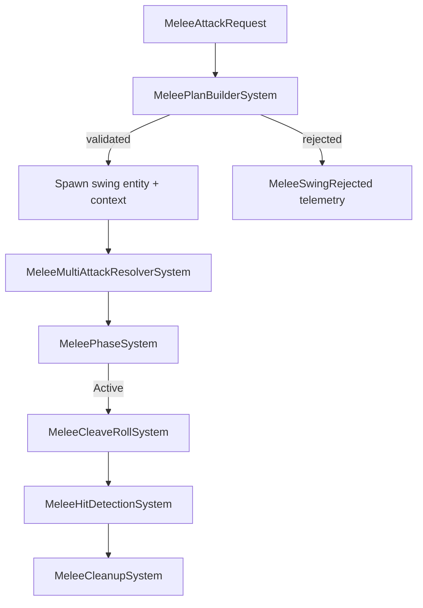

# Framework.Melee Subsystem Design

## Intent

Deliver a deterministic, Burst-friendly melee stack that mirrors the request → plan → run clarity of the spell pipeline while remaining purpose-built for per-frame swing logic. The subsystem integrates cleanly with Resources, Damage, Cooldowns, Temporal, TimedEffect, AreaEffects, Spells, Stats, DOT, HOT, Buffs, and Core without introducing asmdef cycles.

## Scheduling & Groups

- `MeleeSystemGroup` (partial) lives under `Framework.Core.Base.RuntimeSystemGroup` and runs before Damage/Heal resolution so generated `DamagePacket`s are consumed in the same frame.
- Runtime ordering: `MeleePlanBuilderSystem` → `MeleeMultiAttackResolverSystem` → `MeleePhaseSystem` → `MeleeCleaveRollSystem` → `MeleeHitDetectionSystem` → `MeleeDefenseWindowSystem` → `MeleeProcStateSystem` → `MeleeCleanupSystem`. Optional future systems (combos, analytics) run after cleanup.
- All runtime systems are `partial struct … : ISystem` to keep Entities source generators happy.

## Data Model

| Structure | Lifetime | Key Fields |
| --- | --- | --- |
| `MeleeWeaponDefBlob` | Authored per weapon / kit. | `WeaponId`, `BaseDamage`, `Windup/Active/Recovery`, `Range`, `BaselineArcDegrees`, `PenetrationCount`, `StaminaCost`, `LockoutSeconds`, `DefaultBypassFlags`, `ProcEntries`, `DefaultCleaveArcDegrees`, `DefaultCleaveMaxTargets`, `GuardCost`, `MultiAttackConfig` (double/triple/flurry chances, AOE chain shape, max chain depth, lockout/delay). |
| `MeleeWeaponSlotElement` | Dynamic buffer on attacker. | `Weapon`, `Definition`, `SlotId`, `Enabled`, `SwingOrder`, `FamilyLockoutSeconds`. |
| `MeleeAttackRequestElement` | Dynamic buffer per attacker. | `Attacker`, `WeaponSlot`, `AimDirection`, `PreferredTarget`, `Flags`, `RequestId`, `ChainDepth`, `ChainShape`, `ChainArcDegrees`, `ChainRadius`, `ChainMaxTargets`, `ChainDelaySeconds`, `ChainLockoutSeconds`. |
| `MeleeCastContext` | Component on swing entity. | `Attacker`, `PreferredTarget`, `WeaponSlot`, `Definition`, `Phase`, `PhaseTimer`, `WindupTime`, `ActiveTime`, `RecoveryTime`, `PenetrationRemaining`, `AimDirection`, `CleaveMode`, `CleaveArcDegrees`, `CleaveMaxTargets`, `DeterministicSeed`, `SequenceId`, `RiposteOrigin`, `CleaveResolved`, `Completed`, `ChainDepth`, `MultiAttackResolved`, `ChainShape`, `ChainArcDegrees`, `ChainRadius`, `ChainMaxTargets`, `ChainDelaySeconds`, `ChainLockoutSeconds`. |
| `MeleeVictimElement` | Dynamic buffer on swing entity. | Dedupes targets per frame (`Target`, `LastHitTick`). |
| `MeleeDefenseTuning` | Component on defender. | `ParryChance`, `DodgeChance`, `BlockChance`, `BlockFlat`, `BlockPercent`, `GuardCost`, `GuardResource`, `RipostePolicy`, `RiposteWeaponSlot`. |
| `MeleeDefenseWindowState` | Component on defender. | `ParryWindowActive`, `WindowExpiry`, `WindowId`. |
| `MeleeProcTableBlob` | Blob referenced by weapon/equipment/buff. | `ProcId`, `ChancePercent`, `InternalCooldownSeconds`, `MaxTriggers`, `WindowSeconds`, `PayloadKind`, `PayloadArgs`, `ChargeMode`, `MaxActivations`, `DurationSeconds`, `TriggerOnZeroDamage`, `TargetMode`, `PayloadRef`. |
| `MeleeProcMergedEntryElement` | Dynamic buffer on swing entity. | Copy of proc entry, deterministic `SourceKey`, `ChargeConsumed`. |
| `MeleeProcRuntimeStateElement` | Dynamic buffer on attacker. | `ProcId`, `SourceKey`, `NextReadyTime`, `TriggerCount`, `WindowExpiry`, `ExpireTime`, `RemainingActivations`. |
| `MeleeLockout` | Component on attacker. | `NextReadyTimeGlobal`, `LastSwingTime`, `LastWeaponFamily`. |
| `MeleeRiposteRequestElement` | Dynamic buffer on attacker. | `SourceSwing`, `AimDirection`, `WeaponSlot`, `ExecuteAtTime`, `SourceRequestId`. |
| `MeleeMultiAttackConfig` | Struct inside weapon blob. | `DoubleChance`, `TripleChance`, `FlurryChance`, `FlurryPerAttack`, `FlurryMaxExtraAttacks`, `MaxChainDepth`, `ChainLockoutSeconds`, `ChainDelaySeconds`, `AreaChance`, `AreaShape`, `AreaArcDegrees`, `AreaMaxTargets`, `AreaRadius`. |
| `DamageShieldStateElement` | Dynamic buffer on defender (from buffs). | Shield `ShieldId`, `BuffId`, `RemainingActivations`, `ExpireTime`, `NextReadyTime`, `InternalCooldown`, trigger flags, payload metadata. |
| `MeleeWardStateElement` | Dynamic buffer on defender (from buffs). | Ward `WardId`, `BuffId`, `RemainingActivations`, `ExpireTime`, `AbsorbFlat`, `AbsorbPercent`, `RemainingPool`, trigger flags. |
| `MeleeTelemetryEvent` | Dynamic buffer on singleton. | Structured debug/telemetry entries. |

### Stats Inputs

- Defensive stats: `Melee.ParryChance`, `.DodgeChance`, `.BlockChance`, `.BlockFlat`, `.BlockPercent`, `.GuardPool`.
- Cleave stats: `Melee.FrontalArcChance`, `.FrontalArcDegrees`, `.FrontalArcMaxTargets`, `.FrontalArcPenetration`.
- Multi-attack stats: `.MultiDoubleChance`, `.MultiTripleChance`, `.MultiFlurryChance`, `.MultiFlurryPerAttack`, `.MultiFlurryMaxExtra`, `.MultiAreaChance`, `.MultiAreaShape`, `.MultiAreaArcDegrees`, `.MultiAreaMaxTargets`, `.MultiAreaRadius`, `.MultiMaxChainDepth`, `.MultiChainLockoutSeconds`, `.MultiChainDelaySeconds`.
- Stats precedence: weapon defaults → equipment passives → buffs/TimedEffects → Stats pipeline snapshot taken by `MeleePlanBuilderSystem`. Clamp chances to 0–100%, keep arcs in 0–360°, enforce depth/extra limits in authoring.

## Deterministic RNG Policy

- Frame token derived from `ElapsedTime / DeltaTime` (rounded down) combined with attacker, slot id, request sequence, and optional salt.
- Roll order:
  1. Multi-attack resolver (triple → double → flurry → AOE chain).
  2. Cleave decision.
  3. Candidate target ordering (distance tie-breakers).
  4. Per-target defense checks (dodge, parry, block).
  5. Shield/ward consumption happens deterministically after blocks.
  6. Proc table iteration (weapon → equipment → buff augments).
  7. Riposte scheduling if parry succeeds.
- N-wield: each slot keeps its own deterministic sequence so dual wielding is repeatable.

## Functional Flows

### Swing Lifecycle


### Multi-Attack Resolver
```mermaid
flowchart TD
    A[Context seeded] --> B[Read weapon+stat multi config]
    B --> C[Roll Triple]
    C -->|success| D[Queue 2 chain requests]
    C -->|fail| E[Roll Double]
    E -->|success| F[Queue 1 chain request]
    F --> G[Roll Flurry Chance]
    G -->|each hit| H[Roll Per-Attack <= Max]
    B --> I[Roll Area Chain]
    I -->|shape found| J[Stamp chain shape/limits]
    {D,F,H,J} --> K[Emit chain requests (skip stamina, tagged with depth)]
```

### Per-Target Resolution
```mermaid
flowchart TD
    A[Candidate] --> B[Validate range/team]
    B -->|fail| Z[Skip]
    B -->|pass| C[Dodge roll]
    C -->|success| M[MeleeDodged telemetry]
    C -->|fail| D[Parry roll/window]
    D -->|success| E[Schedule riposte, trigger shields if configured]
    D -->|fail| F[Block roll]
    F -->|success| G[Guard/Block reduction]
    F -->|fail| H[No block]
    G --> I[Apply wards]
    H --> I
    I --> J[Queue DamagePacket if damage > 0]
    J --> K[Evaluate procs (weapon/equipment/buff)]
    K --> L[Telemetry + proc payload routing]
```

### Chain Shapes

- **Arc (Frontal/Stat-driven)**: resolves to cleave (single swing uses multi-target arc with penetration/limit overrides).
- **Rear Arc**: uses inverted aim direction; only targets behind attacker within arc deg/max target limit.
- **True Area**: radial search using configured radius (`ChainRadius`) and max target count.

### Wards & Shields

1. Dodge/parry/block resolve first.
2. Wards (charges + pooled absorption) reduce damage to zero or lower.
3. Damage is enqueued.
4. Shields trigger payloads (damage/DOT/HOT/buff/area/spell) based on configured triggers (on block, on parry, on zero damage).
5. Telemetry events emitted: `MeleeWardConsumed`, `DamageShieldTriggered`.

## Integrations

- **Damage**: `DamageFactory.EnqueueDamage` for base swing damage, proc extra hits, and shield retaliation payloads.
- **Resources**: Plan builder spends stamina; hit detection charges guard costs; chain requests can skip costs via `MultiAttackChain` flag.
- **Cooldowns**: Global lockout in `MeleeLockout`, per-weapon family lockouts, optional chain-specific delay/lockout sourced from weapon stats.
- **Temporal**: All timings (windup/active/recovery/lockout/chain delay) scaled by `TemporalPolicy.IntervalMultiplier`.
- **Buffs**: Equipment passives use `EquipmentBuffElement` to inject proc tables; temporary buffs use `ProcAugmentElement`. Buff payload specs drive shields/wards.
- **Spells**: Proc payload kind `Spell` & `ScriptFeature` route into `SpellPipelineFactory` or script bridges (e.g., pet summoning).
- **DOT/HOT/Area**: Dedicated factories (`DotFactory`, `HotFactory`, `AreaEffectFactory`) invoked via `MeleeProcRouter`.
- **Telemetry**: Standardised buffer events - `SwingBegan`, `SwingRejected`, `Hit`, `Dodged`, `Parried`, `Blocked`, `RiposteQueued`, `ProcTriggered`, `CleaveTriggered`, `WardConsumed`, `DamageShieldTriggered`.
- **Authoring**: Weapon blobs supply base stats & multi-attack config; authoring tooling should expose chain shapes, lockouts, and proc tables.

## File Layout

```
Framework/Melee/
  Framework.Melee.asmdef
  Authoring/
    MeleeWeaponAuthoring.cs
    MeleeDefenseAuthoring.cs
  Components/
    MeleeOperationalComponents.cs
    MeleeCommon.cs
  Blobs/
    MeleeWeaponDefBlob.cs
    MeleeProcTableBlob.cs
  Runtime/
    SystemGroups/MeleeSystemGroup.cs
    Systems/
      MeleePlanBuilderSystem.cs
      MeleeMultiAttackResolverSystem.cs
      MeleePhaseSystem.cs
      MeleeCleaveRollSystem.cs
      MeleeHitDetectionSystem.cs
      MeleeDefenseWindowSystem.cs
      MeleeProcStateSystem.cs
      MeleeCleanupSystem.cs
    Utilities/
      MeleeProcRouter.cs
      MeleeDeterministicRng.cs
      MeleeTelemetryWriter.cs
  Docs/
    MeleeSubsystemSpec.md
    MeleeAuthoringGuide.md
  Tests/
    Framework.Melee.Tests.asmdef
    Runtime/…
```

## Task Breakdown (high level)

1. Finalise asmdef references (Core, Resources, Temporal, Cooldowns, Buffs, DOT, HOT, Damage, AreaEffects, Stats, Spells, TimedEffect).  
2. Define components/blobs for weapons, requests, context, procs, multi-attack chain.  
3. Implement runtime systems (plan → multi-attack → phase → hit → cleanup).  
4. Implement proc routing + shield/ward consumption + telemetry utilities.  
5. Populate authoring scripts / conversion hooks.  
6. Build headless ECS tests: base hit, dodge/parry/block, dual wield cadence, proc routing per source, chain (double/triple/flurry/AOE), shields/wards, deterministic replay.  
7. Update docs & authoring guides; sync via `python Framework/sync_framework.py --delete --only-code`.  
8. Integrate with content (weapons, buffs, equipment passives).

## Acceptance Criteria

- Melee requests spawn swing contexts deterministically; multi-attack chain scheduling obeys weapon/stat config and depth limits.
- Defense pipeline executes in order: Dodge → Parry → Block → Ward → Damage → Shield.
- Procs merge weapon, equipment, and buff tables without mutation, respect ICD/charge/duration, and route payloads to the correct subsystems.
- Shields and wards consume charges/pools and trigger telemetry alongside payload routing.
- Dual wield & N-wield behave deterministically with per-slot lockouts.
- Telemetry buffer contains the expected events for plan, hit, defense, procs, shields, and multi-attacks.
- Headless test suite covers the scenarios listed above and passes in CI.

## Risks & Mitigations

- **Determinism across multi-attack chains**: rely on frame token, chain depth capping, and deterministic traversal; add regression tests.  
- **Proc spam / perf**: limit proc table sizes authoring-side, share runtime buffers, clamp flurry max extra.  
- **Area targeting perf**: fallback to spatial partitioning if large-scale AoE chains become costly.  
- **Authoring complexity**: provide validation for stat ranges and multi-attack configs; surface chain depth and lockout warnings in tooling.  
- **Telemetry volume**: gate verbose logging with `MeleeDebugConfig`.

## Capabilities Overview

- Deterministic N-wield (1…N weapon slots) with independent lockouts.  
- Multi-attack chains: double, triple, per-hit flurry rolls, and alternate shapes (frontal arc, rear arc, true area).  
- Equipment/buff-added procs that route through the shared Buffs/Spells effect engine.  
- Buff-authored melee wards (absorb hits/pool) and damage shields (retaliation payload) that slot directly into the hit resolution order.  
- Seamless interoperability with DOT/HOT/Buff/Script/Spell factories for proc payloads.  
- Comprehensive telemetry for debugging combat timelines.

### API Helpers

- `MeleeRequestFactory.QueueAttack` handles request sequencing, default flags, and optional chain overrides:

```csharp
var options = MeleeRequestFactory.CreateOptions(new FixedString32Bytes("MainHand"), aimDir, preferredTarget);
options.SkipStaminaCost = debugMode;
uint requestId = MeleeRequestFactory.QueueAttack(ref entityManager, attacker, in options);
```

- `MeleeProcUtility` appends/removes proc tables supplied by equipment and buffs without touching melee systems:

```csharp
MeleeProcUtility.AddEquipmentProc(ref entityManager, attacker,
    new FixedString64Bytes("Buff.RazorStrikes"),
    CreateBleedProcBlob(0.25f));

MeleeProcUtility.AddProcAugment(ref entityManager, attacker,
    new FixedString64Bytes("Potion.StormInfusion"),
    CreateShockProcBlob(),
    expireTime: SystemAPI.Time.ElapsedTime + 15f);
```

## Worked Examples

### Example 1: Dual-Wield Rogue with Flurry Chain

**Authoring**
- `MainHand` slot references `Daggers.BladeLeft` weapon blob: base damage 35, lockout 0.6s, `MultiAttack` double 20%, triple 5%, flurry chance 30%, flurry per-attack 40%, max extra 2, area chance 0.
- `OffHand` slot references `Daggers.BladeRight` weapon blob identical to main hand but with `FamilyLockoutSeconds = 0.2f` to interleave swings.
- Stats (from gear/buffs): `Melee.MultiDoubleChance +10`, `Melee.MultiFlurryChance +5`, `Melee.MultiMaxChainDepth = 3`.
- Equipment passive “Razor Strikes” adds proc table via `EquipmentBuffElement`: 25% chance to apply Bleed DOT (`DotFactory`) with 6s duration, ICD 4s.

```csharp
// Weapon authoring (ScriptableObject -> blob build)
builder.Construct(in weaponDef, weapon =>
{
    weapon.WeaponId = new FixedString64Bytes("Daggers.BladeLeft");
    weapon.BaseDamage = new DamagePacket { Amount = 35, CritMult = 1.4f };
    weapon.WindupSeconds = 0.25f;
    weapon.ActiveSeconds = 0.15f;
    weapon.RecoverySeconds = 0.35f;
    weapon.PenetrationCount = 1;
    weapon.LockoutSeconds = 0.6f;
    weapon.StaminaCost = 8;
    weapon.DefaultCleaveArcDegrees = 30f;
    weapon.DefaultCleaveMaxTargets = 1;
    weapon.MultiAttack = new MeleeMultiAttackConfig
    {
        DoubleChancePercent = 20f,
        TripleChancePercent = 5f,
        FlurryChancePercent = 30f,
        FlurryPerAttackPercent = 40f,
        FlurryMaxExtraAttacks = 2,
        MaxChainDepth = 3,
        ChainLockoutSeconds = 0f,
        ChainDelaySeconds = 0f,
        AreaChancePercent = 0f,
        AreaShape = MeleeChainAttackShape.None
    };
    // Proc table empty here; equipment buff will add bleed proc.
});

// Equipping passive that contributes procs
var equipBuffer = entityManager.AddBuffer<EquipmentBuffElement>(player);
equipBuffer.Add(new EquipmentBuffElement
{
    BuffId = new FixedString64Bytes("Rogue.RazorStrikes"),
    ProcTable = CreateBleedProcBlob(0.25f, icdSeconds: 4f)
});

// Stat buff (e.g., from gear set)
var stats = new MeleeStatSnapshot
{
    MultiDoubleChance = 10f,
    MultiFlurryChance = 5f,
    MultiMaxChainDepth = 3
};
entityManager.SetComponentData(player, stats);
```

**Runtime Flow**
1. Player enqueues attacks for both weapon slots. Plan builder validates stamina, uses per-slot lockouts (main hand 0.6s, off hand 0.2s family) and spawns swing contexts with independent deterministic seeds.
2. Multi-attack resolver for main hand rolls triple (5% base + stat), succeeds → queues two chain requests with `ChainDepth = 1`, `SkipStaminaCost`. It also rolls flurry (chance 35%) and succeeds twice, queuing two more chain requests (depth 1, 2 respectively).
3. Chain requests re-enter plan builder; ignore global lockout but respect chain delay (0) and optional chain lockout (from weapon config). Each chain request executes as a normal swing with `MultiAttackChain` flag.
4. Cleave roll uses stat-driven frontal arc chance. Suppose no cleave; swings target single enemy.
5. Hit detection: enemy has dodge 10%, parry 5%, block 0. Attack hits. `MeleeProcMergedEntryElement` iteration merges:
   - Main weapon procs (none beyond innate bleed)  
   - Equipment passive “Razor Strikes” table (25% bleed)  
6. RNG for proc rolls 18% < 25% → bleed applied. Because the proc has ICD, runtime state schedules next-ready time. Telemetry logs `MeleeProcTriggered`.
7. Shields/Wards (if any) evaluated after block. None present → damage applied. Telemetry logs `MeleeHit`. Chain swings follow deterministically.

### Example 2: Paladin with Defensive Shield & AOE Chain

**Authoring**
- Weapon blob `WarhammerOfLight`: base damage 60, lockout 1.2s, `MultiAttack` area chance 40%, shape `TrueArea`, radius 4m, max targets 5, chain delay 0.15s, chain lockout 0.3s.
- Buff “Divine Bulwark” provides:
  - Melee ward spec: `MaxActivations = 3`, `AbsorbFlat = 20`, `TriggerOnZeroDamage = 1`.
  - Damage shield spec: `MaxActivations = 5`, `InternalCooldown = 1.5s`, `TriggerOnParry = 1`, payload = Holy nova (area effect via `AreaEffectFactory`).
- Stats: `Melee.MultiAreaChance +20`, `Melee.MultiAreaRadius +1`, `Melee.BlockPercent +15`.

```csharp
// Weapon blob multi-attack configuration
weapon.MultiAttack = new MeleeMultiAttackConfig
{
    AreaChancePercent = 40f,
    AreaShape = MeleeChainAttackShape.TrueArea,
    AreaRadius = 4f,
    AreaMaxTargets = 5,
    ChainDelaySeconds = 0.15f,
    ChainLockoutSeconds = 0.3f
};

// Buff definition (serialized ScriptableObject -> blob) adding ward & shield
buff.DamageShields.Add(new DamageShieldSpec
{
    ShieldId = new FixedString32Bytes("Paladin.DivineBulwark.Shield"),
    MaxActivations = 5,
    InternalCooldownSeconds = 1.5f,
    TriggerOnParry = 1,
    PayloadKind = (byte)MeleeProcPayloadKind.AreaEffect,
    PayloadRef = new FixedString64Bytes("AreaEffect.HolyNova"),
    ArgFloat0 = 6f,        // radius
    DurationSeconds = 3f
});

buff.MeleeWards.Add(new MeleeWardSpec
{
    WardId = new FixedString32Bytes("Paladin.DivineBulwark.Ward"),
    MaxActivations = 3,
    AbsorbFlat = 20f,
    TriggerOnZeroDamage = 1
});

// Applying buff at runtime
BuffFactory.Apply(ref entityManager, paladin, new FixedString64Bytes("Paladin.DivineBulwark"), duration: 30f, stacks: 1);
```

**Runtime Flow**
1. Plan builder spawns swing, multi-attack resolver rolls area chain (40% + 20% stat = 60%) → success. Queues area chain request with `ChainShape = TrueArea`, `ChainRadius = 5`, `ChainMaxTargets = 5`.
2. Active phase: first swing targets primary foe. Block check fails; wards absorb 20 damage (telemetry `WardConsumed`). Remaining damage applied.
3. Shield triggers on parry only; since no parry, shield remains.
4. Area chain request kicks in after 0.15s delay. Chain swing uses radial gather and hits up to 5 nearby enemies, each running through dodge/parry/block/ward/shield logic.
5. If any enemy parries a later swing, shield payload triggers holy nova area effect via proc router, respecting ICD.

### Example 3: Weapons with Proc-Driven Spell Payloads

**Authoring**
- Weapon blob `StormcallerStaff` includes proc table entry:
  - `ProcId = "LightningSurge"`, chance 12%, ICD 6s, payload kind `Spell`, payload ref `Spells.LightningNova`, target mode `Self`.
- Equipment passive adds proc `ArcaneEcho`: chance 20%, charge mode `PerTriggerSuccess`, `MaxActivations = 3`, duration 30s, payload kind `ScriptFeature`, bridging to custom feature (summon pet).
- Buff “Storm Infusion” adds proc augment `ShockOverload`: chance 100%, ICD 10s, per-target charge, payload kind `AreaEffect` (radius 3, lifetime 5s).

```csharp
// Weapon proc entry built into blob
var procBuilder = builder.Allocate(ref weapon.ProcEntries, 1);
procBuilder[0] = new MeleeProcEntry
{
    ProcId = new FixedString32Bytes("LightningSurge"),
    ChancePercent = 12f,
    InternalCooldownSeconds = 6f,
    PayloadKind = MeleeProcPayloadKind.Spell,
    PayloadRef = new FixedString64Bytes("Spells.LightningNova"),
    TargetMode = MeleeProcTargetMode.Self
};

// Equipment passive & buff augment installed at runtime
var equipProcs = entityManager.AddBuffer<EquipmentBuffElement>(caster);
equipProcs.Add(new EquipmentBuffElement
{
    BuffId = new FixedString64Bytes("Mage.ArcaneEcho"),
    ProcTable = CreateProcBlob(
        procId: "ArcaneEcho",
        chance: 0.20f,
        chargeMode: MeleeProcChargeMode.PerTriggerSuccess,
        maxActivations: 3,
        durationSeconds: 30f,
        payloadKind: MeleeProcPayloadKind.ScriptFeature,
        payloadRef: "Scripts.SummonArcaneFamiliar")
});

var augmentProcs = entityManager.AddBuffer<ProcAugmentElement>(caster);
augmentProcs.Add(new ProcAugmentElement
{
    SourceBuffId = new FixedString64Bytes("Mage.StormInfusion"),
    ProcTable = CreateAreaProcBlob(
        procId: "ShockOverload",
        chance: 1f,
        icdSeconds: 10f,
        chargeMode: MeleeProcChargeMode.PerTargetApplied,
        payloadKind: MeleeProcPayloadKind.AreaEffect,
        payloadRef: "AreaEffect.LightningField",
        radius: 3f,
        lifetime: 5f),
    ExpireTime = SystemAPI.Time.ElapsedTime + 20f
});
```

**Runtime Flow**
1. Plan builder merges weapon proc (LightningSurge), equipment proc (ArcaneEcho) and buff proc (ShockOverload). `MeleeProcMergedEntryElement` holds deterministic source keys so ICDs are tracked separately.
2. On hit:
   - LightningSurge roll 12% → fails. Nothing triggered.
   - ArcaneEcho roll 20% → success, charges decremented, script feature called through router.
   - ShockOverload triggers (100% chance). Router calls `AreaEffectFactory.SpawnCircle` with configured radius/lifetime.
3. Telemetry logs each proc in order, with source key preserved for debugging.
4. Proc runtime state ensures ArcaneEcho stops after 3 charges or duration expiry; ShockOverload respects its ICD per attacker.

## Open Questions

1. LOS / obstruction policy for melee arcs and area chains (physics vs analytic checks).  
2. Shared lockout groups vs per-slot lockouts for complex weapon sets (e.g., dual wield + flurry).  
3. Animation-driven hit volumes vs analytic cones/circles for rear/area chains.  
4. Whether riposte swings bypass defense or follow the full defense pipeline.  
5. Editor UX for viewing and tuning multi-attack chain chances and stat overrides.
## Open Questions

1. LOS / obstruction policy for melee arcs and area chains (physics vs analytic checks).  
2. Shared lockout groups vs per-slot lockouts for complex weapon sets (e.g., dual wield + flurry).  
3. Animation-driven hit volumes vs analytic cones/circles for rear/area chains.  
4. Whether riposte swings bypass defense or follow the full defense pipeline.  
5. Editor UX for viewing and tuning multi-attack chain chances and stat overrides.
